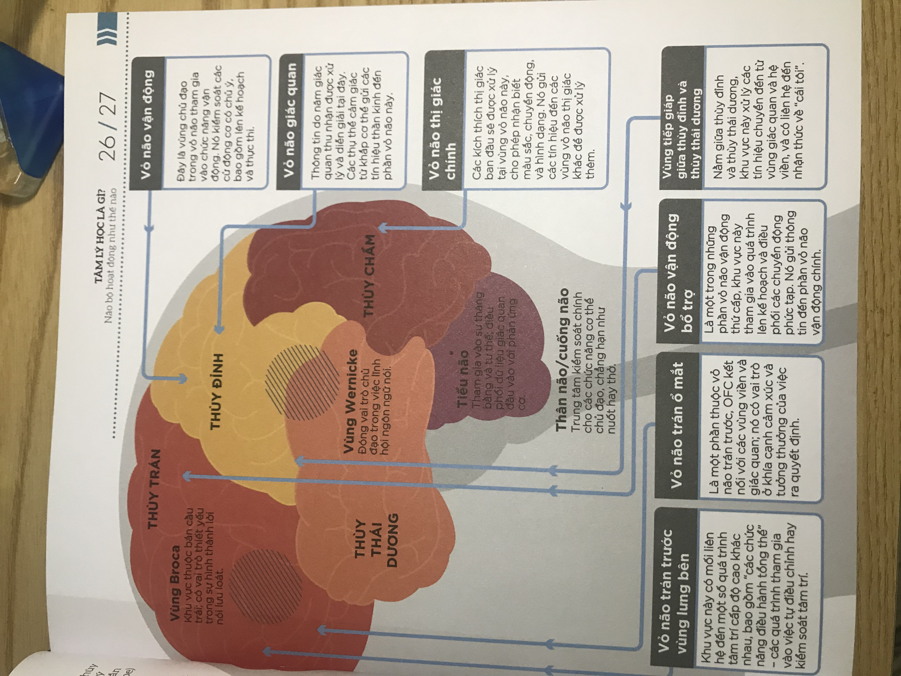

## 1.Học thuyết phân tâm học

### Tâm trí  

    - Vô thức: che giấu khát khao và suy tư của người.   
        + Cái nó: đánh lừa suy nghĩ theo hướng tích cực khi gặp vấn đề khó khăn.  
        + Cái tôi: quyết định việc sẽ làm.
        + Siêu tôi: nhận thức được cái gì nên làm cái gì không, cái nào sẽ tốt.  
    - Tiền ý thức: chứa các thông tin như ký ức tuổi thơ.
    - Ý thức: chứa đựng tư tưởng và cảm xúc.

## 2.Hành vi học
```  
  Hành vi của con người là do học hỏi từ thế giới xung quanh.  
  Mọi hành vi đều là kết quả của một kích thích kích hoạt phản ứng cụ thể.
  Cá tính con người được định hình bởi hành vi được học hỏi, bởi di truyền trạng thái cảm xúc,
  cách bộ não xử lý thông tin, và thế giới xung quanh.
  Huấn luyện ngôn ngữ và nhận thức sớm.
```
Phương pháp để tạo ra sự thay đổi hành vi:  
+ Củng cố:  
  + Tích cực: trao phần thưởng khi hành vi tốt.
  + Tiêu cực: lấy đi thứ gì đó xấu để khuyến khích hành vi tốt.
+ Trừng phạt:  
  + Tích cực: làm gì đó không dễ chịu để ngừng hành vi xấu.
  + Tiêu cực: lấy thứ yêu thích để ngừng các hành vi không mong muốn.

## 3.Thuyết nhân bản
```
Tôi nhìn bản thân như thế nào? Khuyến khích rèn luyện ý chí tự do, tự đưa ra lựa chọn, tự tìm tòi học hỏi mà bỏ qua yếu tố sinh học.
```
Tâm lý học cấu trúc: luôn tách 1 ảnh ra nền và vật chủ.

Hình ảnh bản thân và cái tôi lý tưởng càng giống nhau ⇒  cảm thấy bản thân có giá trị + cảm xúc tích cực

## 4.Tâm lý học nhận thức

Tâm trí con người như 1 cỗ máy tính, phân tích cách con người xử lý thông tin ⇒ quyết định hành vi và cảm xúc của họ.

Input: dính 🪲.

Handle: phân tích và đưa ra hướng giải quyết.

Output: fix 🐞

**Thiên kiến về nhận thức:**

Tâm trí mắc 1 sai lầm trong quá trình xử lý ⇒ hành vi lệch lạc

- Neo bám (anchoring): không đọc hết thông tin, chú trọng quá vào tin đầu.
- Ngộ nhận tỷ lệ cơ sở (base-rate fallacy): loại bỏ các giả định khi nhận 1 thông tin mới.
- Hiệu ứng đoàn tàu (bandwagon effect): tin vào đa số
- Ngộ nhận con bạc(gambler's fallacy): một điều xảy ra thường xuyên sẽ không xảy ra tiếp.
- Giảm giá theo đường cong (hyperbolic discounting): thấy cái lợi trước mắt.
- Bỏ qua xác suất(neglect of probability): lô đề, cờ bạc.
- Thiên kiến nguyên trạng (status quo bias): khó từ bỏ 1 thói quen.
## 5.Tâm lý sinh học
```
Tư duy, cảm xúc, hành vi của con người xuất phát từ sinh lý.
```
Các cá nhân thay đổi cách sử dụng ngôn ngữ, ý thức, ký ức và hệ thống sinh học của mình để đương đầu với môi trường sống của họ.
## 6.Não bộ hoạt động ntn

Mỗi 1 bên bán cầu não điều khiển 1 bên cơ thể.
```
Bán cầu trái điều khiển bên phải cơ thể, là phần phân tích của bộ não ⇒ logic, lý lẽ, ngôn ngữ, quyết định. Tự nhiên
```
```
Bán cầu phải điều khiển bên trái cơ thể, là phần cảm xúc, sáng tạo của não ⇒ cảm nhận của giác quan, trí tưởng tượng. Xã hội
```
Hai bán cầu chia thành 4 thuỳ kép:
- Thuỳ trán: nhận thức ở mức độ cao và hoạt động của người.
- Thuỳ thái dương: trí nhớ ngắn hạn và dài hạn.
- Thuỳ chẩm: thị giác.
- Thuỳ đỉnh: các chức năng của giác quan.

{width=300px height=200px}

## 7.Trí nhớ hoạt động ntn

Có 5 dạng trí nhớ:

- Trí nhớ tình tiết: thường liên quan đến cảm xúc, cảm nhận. Ngày bị rắn cắn - đéo thể quên đc.
- Trí nhớ ngữ nghĩa: lưu giữ các thông tin có căn cứ thực tế. Viết 1 vài từ mà cảm giác sai chính tả vì nhìn lạ.
- Trí nhớ làm việc: lưu giữ thông tin tạm thời. Đang code bị phiền là đíu biết đang code gì
- Trí nhớ thao tác: các hành động học hỏi dc mà k cần nhớ vẫn làm đc. Đi, đứng, nằm
- Trí nhớ ẩn: ký ức có ảnh hưởng đến hành vi. Gặp rắn là chạy =))

Vậy dejavu là do đâu?

Ký ức hình thành:
- Tập trung vào 1 sự kiến hình thành 1 vùng ký ức, thuỳ trán sẽ ức chế những thứ gây mất tập trung. 0.2s.
- Cảm xúc: gia tăng sự chú ý khiến sự kiện dễ thành ký ức hơn. Hạch hạnh nhân xử lý 0.25s.
- Cảm giác: kích thích trải nghiệm, dễ hồi tưởng lại đc.
- Trí nhớ làm việc: lưu giữ thông tin cho đến khi cần.
- Hồi hải mã: mã hoá thông tin và gửi về vùng não ban đầu ghi nhận.
- Củng cổ: cố định vùng thành ký ức.

