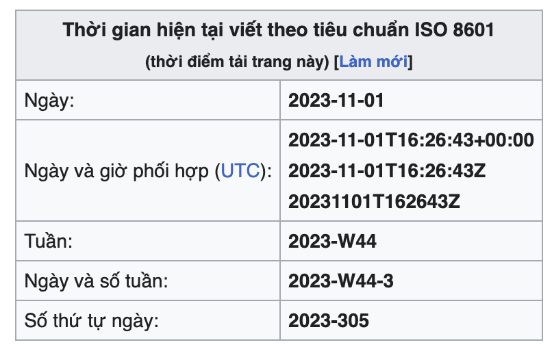

## Vài quy tắc
### 1.Nhất quán cấu trúc endpoint  
    - Sử dụng 1 convention trong param, resource, body...(snake_case, camelCase)  
    - Sử dụng cùng một phương thức xác thực và ủy quyền cho tất cả các endpoint (xác thực bằng token, session, basic authen)
    - Sử dụng 1 HTTP header (Api-key, abc-api-key)
    - Dùng HTTP status code dựa trên loại response:
        - 200: thành công
        - 201: tạo dữ liệu thành công
        - 400: yêu cầu không hợp lệ
        - 401: truy cập trái phép
        - 403: không có quyền truy cập
        - 404: không có tài nguyên
        - 429: quá nhiều yêu cầu
        - 5xx: lôi hệ thống(khá khó xử lý vì response trả về không cùng 1 nơi)
    - Dùng HTTP method dựa trên hành động:
        - GET: lấy dữ liệu
        - POST: tạo dữ liệu
        - DELETE: xóa dữ liệu
        - PUT: cập nhật toàn bộ hoặc tạo mới dữ liệu
        - PATCH: cập nhật 1 phần dữ liệu
###  2.Sử dụng chuẩn ISO 8601 UTC cho các giá trị thời gian

### 3.Các public endpoint có thể không cần xác thực
### 4.Có health check endpoint, thêm cả prometheus thì càng tốt
### 5.Tạo version cho API
### 6.Cho phép dùng api-key trong internal service hoặc bên thứ 3
### 7.Sử dụng PATCH thay vì PUT
    - Vì patch để cập nhật 1 phần dữ liệu, ít khi mà cần phải sửa toàn bộ dữ liệu
### 8. Sử dụng phân trang
### 9. Dùng tên tường minh, dễ hiểu
### 10. Lỗi được trả về cần tường minh và qua xử lý, tránh trả về thẳng exception
### 11. Trả về dữ liệu được tạo khi POST
### 12. Endpoint, param, body, tên cụ thể
